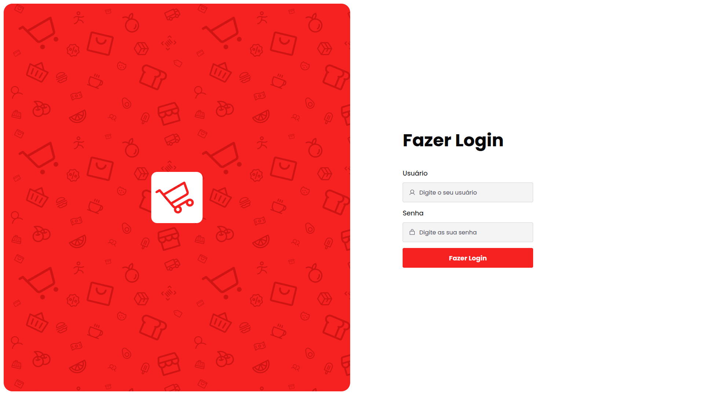
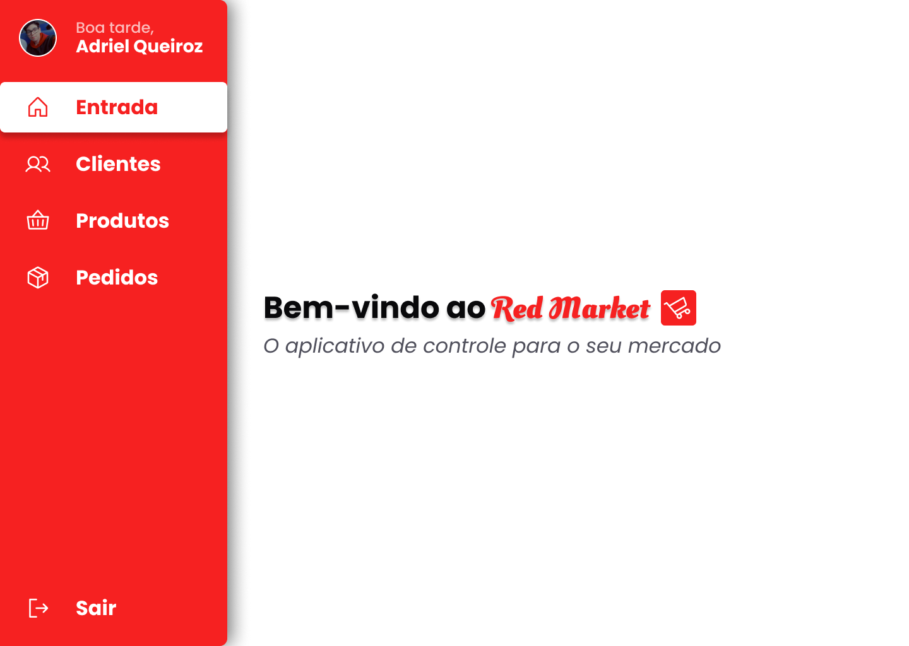
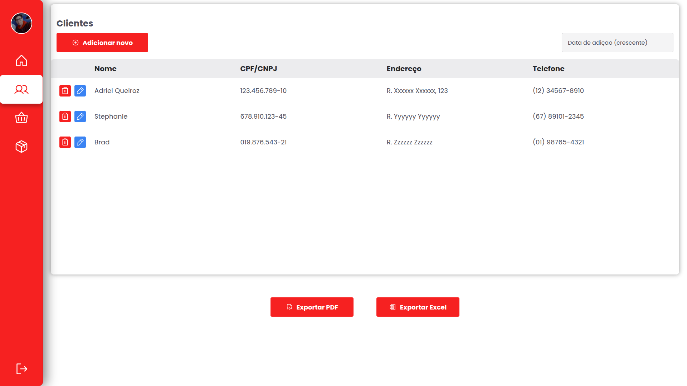
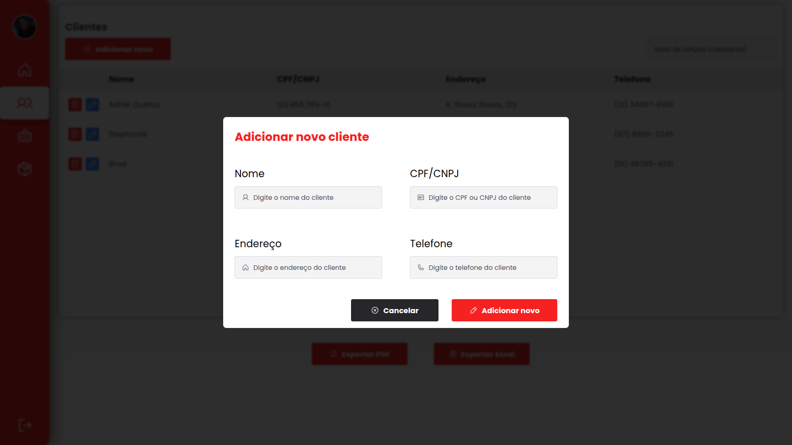
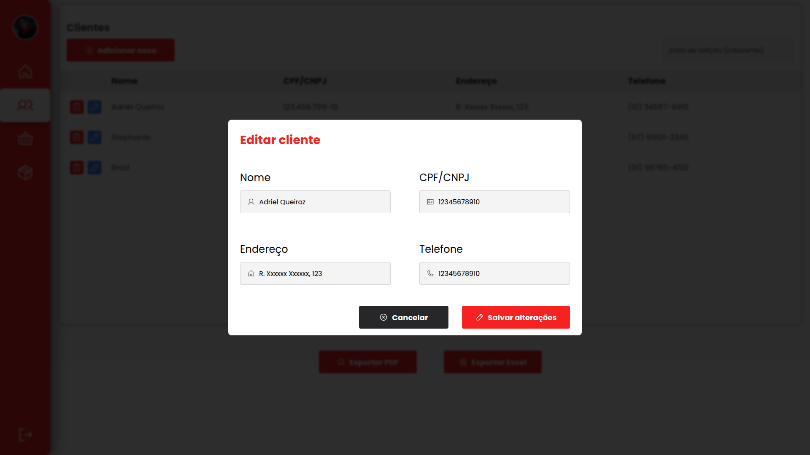
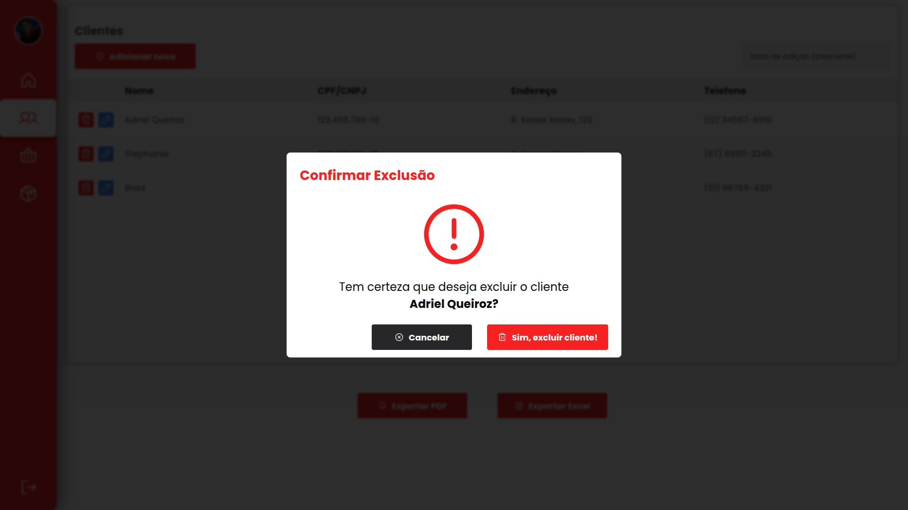

<h1 align="center"> Red Market </h1>

<p align="center">
Controle de Supermercado

<p align="center">
<a href="#-sobre-o-projeto">Projeto</a>&nbsp;&nbsp;&nbsp;|&nbsp;&nbsp;&nbsp;
<a href="#-funcionalidades">Funcionalidades</a>&nbsp;&nbsp;&nbsp;|&nbsp;&nbsp;&nbsp;
<a href="#-tecnologias-utilizadas">Tecnologias</a>&nbsp;&nbsp;&nbsp;|&nbsp;&nbsp;&nbsp;
<a href="#-layout">Layout</a>&nbsp;&nbsp;&nbsp;|&nbsp;&nbsp;&nbsp;
<a href="#como-executar">Como Executar</a>&nbsp;&nbsp;&nbsp;|&nbsp;&nbsp;&nbsp;
<a href="#autor">Autor</a>&nbsp;&nbsp;&nbsp;|&nbsp;&nbsp;&nbsp;
<a href="#memo-licença">Licença</a>
</p>

## 💻 Sobre o Projeto

O **Red Market** é um sistema de controle de supermercado desenvolvido como parte do teste admissional para a empresa Maximus Agronegócios. O objetivo do projeto é facilitar a gestão de clientes, produtos e pedidos em supermercados, proporcionando uma solução eficiente e intuitiva.

## 📸 Previews do Projeto

Veja abaixo algumas imagens do projeto em funcionamento.

<p align="center">
    
</p>
<p align="center">
    
</p>
<p align="center">
    
</p>
<p align="center">
    
</p>
<p align="center">
    
</p>
<p align="center">
    
</p>

## 🛒 Funcionalidades

- Cadastro de clientes
- Cadastro de produtos
- Cadastro de pedidos
- Tabela de dados (CRUD)

## 🚀 Tecnologias Utilizadas

Este projeto foi desenvolvido com as seguintes tecnologias:

- React
- Material UI
- Firebase
- Figma
- Git e Github

## 🔖 Layout

Para fazer o layout deste projeto utilizei o Figma, conforme exigido pela empresa. Você pode visualizar o layout do projeto através [DESTE LINK](https://www.figma.com/community/file/1522031226309851407).

## ⚛️ Como Executar

1. Clone este repositório:
   ```bash
   git clone https://github.com/adrielqueiroz2006/red-market
   ```
2. Instale as dependências:
   ```bash
   npm install
   ```
3. Inicie o projeto:
   ```bash
   npm start
   ```
4. Logue com os dados:
   - Usuário: `red-market@gmail.com`
   - Senha: `redmarket`

## 🙋 Autor

Desenvolvido por Adriel Queiroz para o teste admissional da Maximus Agronegócios.

## :memo: Licença

Este projeto está sob licença do MIT.
